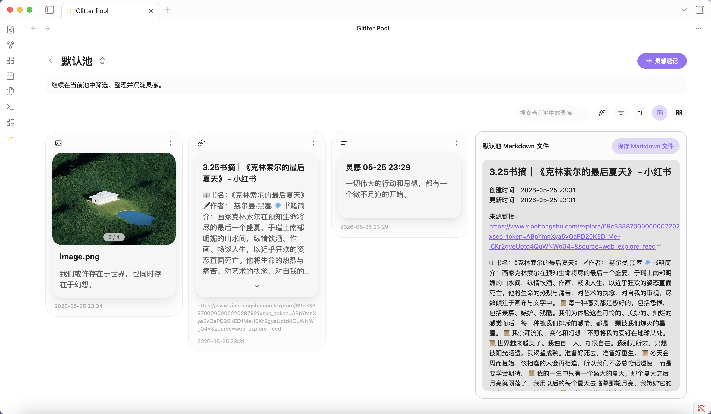
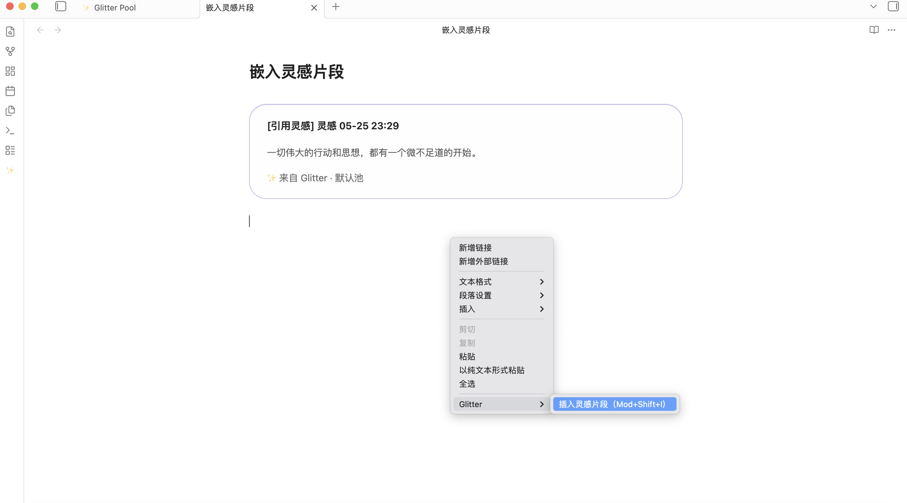
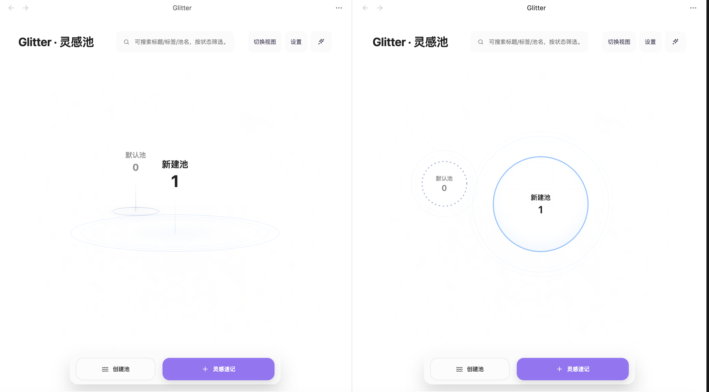
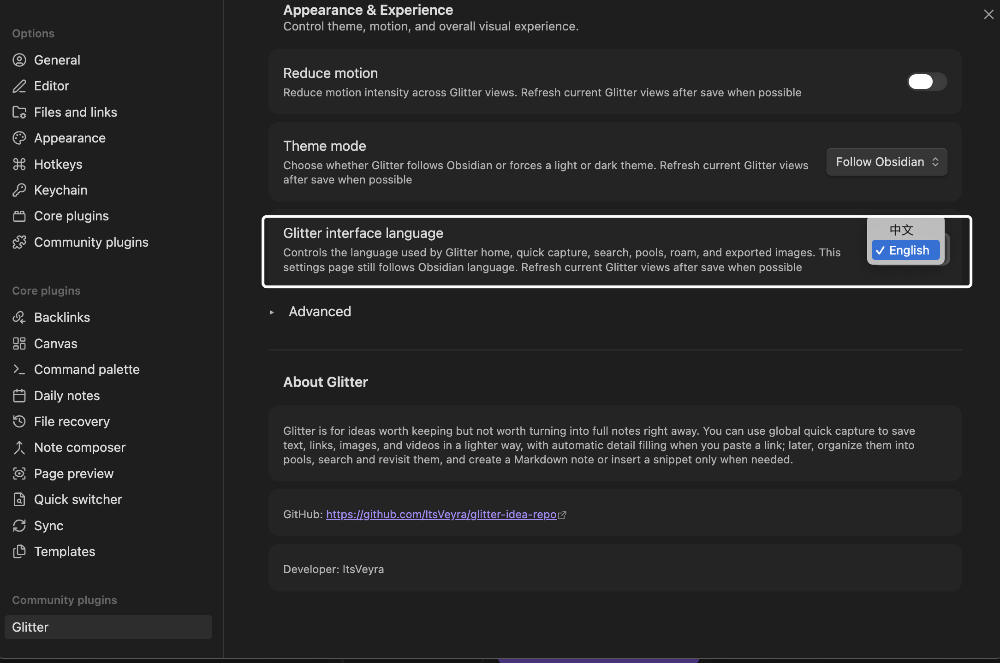

# Glitter

Glitter is a lightweight idea capture plugin for Obsidian, designed for saving brief, fleeting thoughts before they disappear. It helps you record ideas first and decide later whether they should remain lightweight, become full notes, or be reused in your writing.

Instead of forcing every small idea into a Markdown file right away, Glitter lets you quickly save text, links, images, and videos as lightweight cards. When the time is right, you can come back to review and organize them, turn them into Markdown files, or reference them directly inside your notes as reusable snippets.

As your ideas accumulate, Glitter also gives them a visual space to grow. With the roam board, you can bring saved cards back into view, connect them, compare them, expand them, and develop them into deeper thinking and longer-form writing.

Glitter is built around a simple design philosophy: respect your taste and working habits, follow the visual language of the theme you already love, and make the plugin feel as native and unobtrusive as possible in daily use.


## Core Capabilities

### 1. Quick Capture
Glitter provides a global quick capture entry for quickly holding onto text, links, images, and videos. For many usage scenarios, it is the first step in "keeping the content before it slips away."

### 2. Roam Board
The roam board is as important as quick capture. It is not just a simple whiteboard add-on page, but a visual space that brings saved ideas back for further organization: you can drag source ideas onto the roam board, continue arranging, connecting, comparing, and grouping them on the canvas, and keep expanding around a theme.

Source blocks on the roam board display the real content directly, instead of collapsing into plain text descriptions:
- Text and link ideas show their corresponding titles, descriptions, and source information;
- Image and video ideas display the media content directly;
- Multi-image ideas are grouped into the same source block while preserving the ability to keep connecting and organizing them;
- Roam history keeps previously created boards so you can continue revisiting, batch-organizing, and extending the workflow;
- When an original idea is edited or deleted, the corresponding source block on the roam board stays in sync as much as possible.

### 3. Pools and Card Organization
Saved ideas enter their corresponding pools and continue to be managed as cards. You can organize them around themes, projects, stages, or any custom structure that fits your workflow.

The home page supports two idea field views: **Fulfillment** and **Ripple**. They only switch the presentation of the underlying pools / fields, without changing the fixed action areas such as the home title, search, settings, status filters, create pool, and idea quick capture. Pool hover actions also follow the current interface language, so English UI actions appear as concise **Edit**, **Delete**, and **Enter** buttons.

Media cards keep their preview behavior in the pool view: clicking an image or video thumbnail opens the larger preview, while preserving native button semantics for accessibility.

### 4. Snippet Insertion and Write-Back
When an idea is ready to enter the writing stage, Glitter lets you insert saved content back into the note body, allowing the flow of "collect first, write later" to close naturally.

### 5. AI Polish
For text you have already written, Glitter can also call a model you configure yourself to perform a real rewrite and polish pass, helping you continue refining and deepening the expression.


## Quick Start

### First Use
1. After enabling the Glitter plugin in Obsidian, click **Open Glitter Home** in the Glitter settings page, or find the default **✨** icon in the left sidebar to enter the plugin home page.  
   
2. Follow the plugin's **first-use flow** to complete the creation of your first idea.  
   

### Usage

#### 1. Quick Capture
Click **Idea Quick Capture**, enter the relevant content in the window, and save to record an idea.
- **Plain text**: follows the principle of prioritizing the content body, with the default title using a timestamp.  
  
- **Link**: after pasting a link, Glitter can automatically recognize it and fill in the basic information.  
  
- **Images and videos**: add media files as attachments, or paste an image directly from the clipboard; after saving, media files are stored by default in the vault path `/Glitter/images`.  
  
- **AI Polish**: once the body is not empty, you can trigger AI Polish. After enabling the feature in settings and filling in your own API Key, Base URL, and Model, you can run a real optimization and moderate expansion pass on the current text. The polish interface keeps the original text, shows the result on the right, and supports retry, cancel, and apply.
- **Create file**: by default, an idea exists inside the plugin as a card, but you can also check "Save idea and create file" while creating it, so saving the idea also generates a note file.
- **Hotkey**: defaults to `Mod (Command/Ctrl) + Shift + J`, and can be changed in settings.

#### 2. Roam Board
When you need to continue organizing, branching, or comparing existing ideas around a theme, you can bring the content into the **Roam Board**.
- Supports placing saved ideas onto the board and continuing to drag, arrange, and connect them;
- Source blocks directly present text, links, images, and videos, so you do not need to keep returning to the card page to review them;
- Multi-image ideas are grouped inside the same source block for easier observation as a set;
- Roam history records created boards so you can continue organizing, revisiting, and batch-managing them;
- When the original idea content is updated, the source block refreshes with it, preventing the canvas content from drifting out of date over time.

#### 3. Pools
Pools are Glitter's idea categorization feature, displayed on the home page as circular ripple forms.
- **View switching**: click **Switch View** at the top of the home page to switch between the **Fulfillment** and **Ripple** idea fields; the former is more stable and aggregated, while the latter emphasizes depth, title connections, and ripple relationships;
- **Create pool**: click **Create Pool**, enter the pool name and description, and save to create a new idea category;
- **Other creation paths**: **Switch Pool** inside the quick capture window can also create a new pool directly;
- **Pool style rules**: by default, the pool with the largest number of ideas is placed at the center of the interface; the solid or dashed state of the center outline is randomly generated by default;
- **Pool editing**: hovering over a pool for 3 seconds triggers **Pool Isolated Mode**. The actions on the right follow the current interface language and can be used to **Edit**, **Delete**, or **Enter** a pool; on the pool home page, clicking the pool name and description also enables in-place editing.

#### 4. Idea Cards
After content is saved, a card for that idea is created in the corresponding pool.
- **Card management**: the card more menu supports actions such as edit, move, delete, create/open file, and view insertion locations in the note body;
- **Media preview**: image and video cards can be opened from their thumbnails for a larger preview;
- **Card display states**: long text content is automatically collapsed; for ideas that have already been created as standalone note files, the color of the top-left content type icon changes to the accent color that follows the current Obsidian theme;
- **Filter, organize, and view**: the top-right of the card area on the pool home page provides the relevant feature buttons.  
  - Ideas can be filtered by **idea status**, **content type**, **creation time**, and more;  
  - Supports viewing in Markdown reading mode, as well as exporting the whole set as a `.md` note file;  
      
  - Supports bulk moving and deleting idea cards, and the bulk move modal can also create a new pool directly.

#### 5. Snippet Insertion
While writing notes, you can insert saved ideas back into the note body for quoting, expanding, and continuing the writing process.
- In the note body, right-click and find Glitter, then choose **Insert Idea Snippet**;
- Hotkey: `Mod (Command/Ctrl) + Shift + I`;
- 

#### 6. Home View Display
The home idea pool display has two view options: **Fulfillment** and **Ripple**. You can choose the one that best fits your preference.
  

#### 7. Bilingual Plugin Interface
Glitter now supports an English interface, which you can choose from the settings page.
  

## Installation and Updates

### Installation
1. Download the latest Glitter release package from this repository;
2. Create the folder `.obsidian/plugins/glitter-idea/` in your vault;
3. Copy `manifest.json`, `main.js`, and `styles.css` from the release package into that folder;
4. Reopen Obsidian, or reload community plugins;
5. Open **Settings → Community plugins** and enable **Glitter**.

### Update
1. Download the latest version of the Glitter release package;
2. Replace the old `manifest.json`, `main.js`, and `styles.css` with the new ones;
3. Reload Obsidian, then confirm that Glitter is enabled and working normally.

## Community Plugin Review and Source

The repository root keeps the release files required for community plugin submission and installation:

- `manifest.json`
- `main.js`
- `styles.css`

The minimal buildable source workspace used for official review is located in [source/](source/).

To reproduce the source verification inside this repository, enter the `source/` directory and run:

```bash
npm install
npm run test
npm run check
npm run build
```

## AI, Network, and Privacy

- Glitter does not provide a developer-hosted account system, and does not require you to log in to a developer service.
- Glitter has **no default telemetry** and does not automatically upload your vault content to developer servers.
- When you actively import a link, Glitter requests that page in order to extract the title, description, and other link information.
- Only when you actively configure `API Key`, `Base URL`, and `Model` in settings and actively trigger **AI Polish** in the interface will the current text content be sent to the model service you specified.
- If you do not use link import, and do not configure or trigger AI, Glitter will not make extra network requests.
- Outside of Obsidian's normal vault read/write behavior, Glitter does not proactively access files outside your vault.

## FAQ

**Q: Why does the installed Glitter interface look different from the demo images?**  
A: Because the UI depends on the theme installed by the user. Glitter aims to blend into the Obsidian ecosystem, respect the user's taste and layout habits, and avoid visually competing with the environment the user has already built.

**Q: What kinds of content is Glitter suitable for recording?**  
A: It is suitable for quickly recording text, links, images, videos, and more. If what you paste is a link, Glitter can also automatically recognize it and fill in the related information.

**Q: At what stage is the roam board most suitable to use?**  
A: When you have already accumulated a batch of ideas and need to continue comparing, associating, branching, and organizing them around a theme, the roam board is more efficient than simply flipping through cards. It is well suited to being the visual workspace before you move into structured organization.

**Q: Does Glitter come with its own AI model?**  
A: No. The AI Polish feature requires you to fill in your own API Key, Base URL, and model name in settings, and the plugin then connects directly to the model service you configured.

**Q: Does every idea automatically create a Markdown file?**  
A: No. Whether to create a file is optional, and you can decide according to your own organization style.

**Q: What is a Pool?**  
A: A pool is used to group and organize ideas. You can classify them by theme, project, writing stage, or any other method that suits you.

**Q: Can I put a saved idea back into the note body?**  
A: Yes. Glitter supports inserting ideas into the note body as snippets, making it easier to continue expanding and referencing them while writing.

**Q: What features will this plugin continue to update in the future?**  
A: Future updates will continue improving idea quick capture, the roam board, card sharing, bubble data charts, and the finer dynamic interaction details inside the plugin views.

## Why Use Glitter

At the core of Glitter's design is not making every idea immediately conform to Obsidian's file structure, but giving inspiration a lighter landing place before it becomes a formal note.

It tries to separate two things that are often tied together: **worth keeping**, and **worth turning into a file right away**. You can save an idea first, then decide whether to categorize it, create a Markdown file for it, or insert it back into your note to keep writing. This both reduces the large number of temporary files created in the vault for quick capture, and makes truly important ideas easier to revisit, reuse, and develop.


<div align="center">

<table>
  <tr>
    <td align="center">
      <sub>SUPPORT GLITTER</sub><br />
      <strong>If Glitter has been useful in your workflow, you can support its ongoing development.</strong><br />
      <sub>
        <a href="https://paypal.me/ItsVeyraYu">International · PayPal.me</a>
        |
        <a href="assets/images/support-alipay.png">中国大陆 · Alipay QR</a>
      </sub>
    </td>
  </tr>
</table>

</div>


