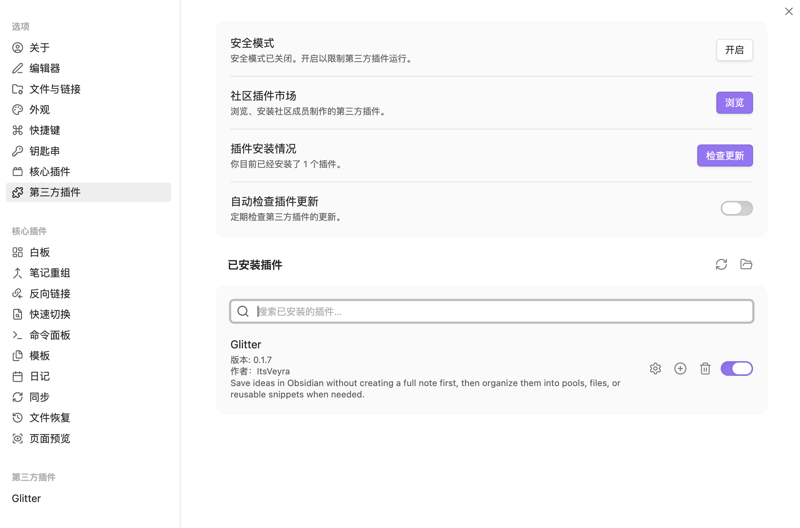

# Glitter

Glitter 是一款面向 Obsidian 的灵感记录插件，适合保存那些值得留下、却不一定需要立刻建成正式笔记的小点子、参考信息和灵感，内容类型涵盖文本、链接、图片与视频。它让你先把内容轻量留存，避免 vault 被大量临时笔记塞满；等真正需要沉淀时，再按需整理、深度沉淀或引用回正文。

它的界面颜色、字体、配置与样式都会跟随用户安装的 Obsidian 主题，目标是在日常使用里尽量保持原生、低负担、可沉浸的体验。

## 为什么使用 Glitter

Glitter 的设计核心，不是让每个想法都立刻服从 Obsidian 的文件结构，而是在“正式笔记”之前，先给灵感一个更轻的落点。

它想拆开两件常被绑在一起的事：**值得留下来**，和 **值得立刻建文件**。你可以先把灵感保存下来，再决定是否分类、是否创建 Markdown 文件、是否插回正文继续写。这样既能减少 vault 里为了速记而产生的大量临时文件，也能让真正重要的灵感更容易被回看、复用和沉淀。

## 核心能力

### 1. 灵感速记
Glitter 提供全局灵感速记入口，用来快速收住文本、链接、图片与视频。对于很多使用场景来说，它是“先留住内容”的第一步。

### 2. 灵感漫游
灵感漫游是与灵感速记同等级的重要能力。它不是简单的白板附加页，而是把已经保存的灵感重新带回可视化整理空间：你可以把来源灵感拖入漫游白板，在画布里继续排布、连接、比较、归纳，并围绕一个主题持续扩展。

漫游里的来源块会直接展示真实内容，而不是退化成一条普通文本说明：
- 文本与链接灵感会显示对应标题、说明与来源信息；
- 图片与视频灵感会直接显示媒体内容；
- 多图灵感会以同一个来源块聚合展示，并保留继续连接与整理的能力；
- 漫游历史会保存已经创建过的白板，方便继续回看、批量整理与延续工作流；
- 当原始灵感被编辑或删除时，漫游里的来源块也会尽量保持同步。

### 3. 池与卡片整理
保存后的灵感会进入对应灵感池，并以卡片形式持续管理。你可以围绕主题、项目、阶段或任何自定义方式组织这些内容。

首页已支持两种灵感场浏览视图：【圆满】与【涟漪】。它们只切换底层灵感池 / 灵感场的表现方式，不会改变首页标题、搜索、设置、状态筛选、新建池与灵感速记等固定操作区。

### 4. 片段插入与回写
当灵感真正进入写作阶段时，Glitter 支持把已保存内容重新插入笔记正文，让“先收集、后成文”的过程自然闭环。

### 5. AI 润色
对于已经写下来的正文，Glitter 还支持调用你自己配置的模型做一轮真实改写与润色，用于继续整理与深化表达。

## 快速上手

### 首次使用
1. 在 Obsidian 中启用 Glitter 插件后，可在 Glitter 设置页里点击**打开 Glitter 首页**，或在 Obsidian 左侧功能区里找到默认启用的 **✨** 图标，进入插件首页。  
   
2. 跟随插件的**首次流程**，完成第一条灵感的创建。  
   

### 使用过程

#### 1. 灵感速记
点击**灵感速记**，在窗口内输入对应内容后保存，即可完成一条灵感的录入。
- **纯文本**：遵循内容主体优先原则，默认标题为时间戳。  
  
- **链接**：粘贴链接后可自动识别并补全基础信息。  
  
- **图片和视频**：在附件中添加媒体文件，或直接粘贴剪切板图像；保存后媒体文件会默认存入仓库路径 `/Glitter/images`。  
  
- **AI 润色**：正文非空后可触发 AI 润色；在设置页中开启对应功能并填写自己的 API Key、Base URL、Model 后，即可对当前文本做一轮真实优化与适度扩写。润色界面会保留原文，并在右侧显示结果，支持重做、取消与采纳。
- **新建文件**：默认灵感在插件内以卡片形式存在，但你也可以在创建灵感时勾选“保存灵感并创建文件”，让它在保存的同时生成一篇笔记文件。
- **快捷键**：默认 `Mod (Command/Ctrl) + Shift + J`，可在设置页中修改。

#### 2. 灵感漫游
当你需要围绕一个主题继续整理、发散或比较已有灵感时，可以把内容带入**灵感漫游**白板。
- 支持把已保存灵感挂入白板并继续拖拽、排布与连接；
- 来源块会直接呈现文本、链接、图片与视频，不需要回到卡片页反复查看；
- 多图灵感会在同一个来源块内聚合展示，方便整组观察；
- 漫游历史会记录已创建的白板，方便继续整理、回看与批量管理；
- 当原始灵感内容更新时，来源块也会跟随刷新，避免画布内容长期失真。

#### 3. 池
池是 Glitter 的灵感分类功能，在首页以圆圈涟漪样式呈现。
- **视图切换**：点击首页顶部的**切换视图**，可在【圆满】与【涟漪】两种灵感场之间切换；前者更稳定聚合，后者更强调纵深感、标题连接与涟漪关系；
- **新建池**：点击**新建池**，输入池分类名称及描述后保存，即可完成一个灵感分类的建立；
- **其它新建路径**：灵感速记窗口中的**切换池**也可以直接新建池；
- **池样式规则**：默认灵感数量最多的池位于界面中心；池中心描边的虚实状态默认随机生成；
- **池编辑**：鼠标停留在池上方 3 秒会触发“池独立模式”，右侧按钮可依次进行**池名称编辑**、**池分类删除**；在池首页内单击池名称和池描述，也可以触发原位内容更改。

#### 4. 灵感卡片
内容保存后，会在对应池内生成属于这个灵感的卡片。
- **卡片管理**：在卡片更多菜单里可进行编辑、移动、删除、创建为文件/打开文件、查看插入正文位置等操作；
- **卡片呈现状态**：文本内容过长时会自动折叠；已经创建为独立笔记文件的灵感，卡片左上角“内容类型图标”的颜色会切换为跟随 Obsidian 主题设置的强调色；
- **筛选、整理与查看**：池首页内卡片区域右上角提供对应功能按钮。  
  - 可按“灵感状态”“内容类型”“创建时间”等方式筛选灵感；  
  - 支持 Markdown 阅读视图查看，以及整体作为 `.md` 笔记文件导出；  
      
  - 支持批量移动、删除灵感卡片，且批量移动弹窗内可直接新建池。

#### 5. 片段插入
写笔记时，可以把已有灵感插入正文，方便引用、延展和继续写作。
- 在笔记正文内右键找到 Glitter，选择**插入灵感片段**；
- 快捷键：`Mod (Command/Ctrl) + Shift + I`；
- 

#### 6. 其他
- 首页“切换视图”现已可用，可在【圆满】与【涟漪】两种首页灵感场之间切换浏览；
- 卡片分享功能仍在规划中。

## 安装与更新

### 安装
1. 从本仓库最新 Release 下载 Glitter 发布包；
2. 在你的 vault 中创建文件夹：`.obsidian/plugins/glitter-idea-plugin/`；
3. 将发布包中的 `manifest.json`、`main.js` 和 `styles.css` 复制到这个文件夹中；
4. 重新打开 Obsidian，或重新加载社区插件；
5. 打开 **Settings → Community plugins**，启用 **Glitter**。

### 更新
1. 下载最新版本的 Glitter 发布包；
2. 用新的 `manifest.json`、`main.js` 和 `styles.css` 替换旧文件；
3. 重新加载 Obsidian，然后确认 Glitter 已正常启用。

## 社区插件审核与源码

本仓库根目录保留社区插件提交与安装所需的发布文件：

- `manifest.json`
- `main.js`
- `styles.css`

用于官方审核的最小可构建源码工程位于 [source/](source/)。

如需在本仓库内复现源码检查，请进入 `source/` 目录后依次运行：

```bash
npm install
npm run test
npm run check
npm run build
```

## AI、联网与隐私说明

- Glitter 不提供开发者托管账号系统，也不要求登录开发者服务。
- Glitter **无默认遥测**，不会自动把你的 vault 内容上传到开发者服务器。
- 当你主动导入链接时，Glitter 会请求对应链接页面以提取标题、描述等链接信息。
- 只有当你在设置中主动配置 `API Key`、`Base URL`、`Model`，并在界面中主动触发 **AI 润色** 时，当前文本内容才会发送到你指定的模型服务。
- 如果你不使用链接导入，也不配置或触发 AI，Glitter 不会额外发起网络请求。
- 除 Obsidian 正常的 vault 读写场景外，Glitter 不会主动访问 vault 外部文件。

## 常见问题与说明

**Q：为什么安装的Glitter的界面效果和演示图不一样？**  
A：因为UI效果取决于用户安装的主题。Glitter力求实现融入Obsidian生态，尊重用户审美与布局习惯，不在视觉上抢夺用户已经建立起来的使用场景。

**Q：Glitter 适合记录哪些内容？**  
A：适合快速记录文本、链接、图片和视频等内容；如果你粘贴的是链接，Glitter 还可以自动识别并补全相关信息。

**Q：灵感漫游适合在什么阶段使用？**  
A：当你已经积累了一批灵感，需要围绕主题继续比较、关联、发散和整理时，灵感漫游会比单纯翻卡片更高效。它适合承担“进入结构化整理之前”的视觉工作台角色。

**Q：Glitter 自带 AI 模型吗？**  
A：不自带。AI 润色功能需要你在设置页中自行填写 API Key、Base URL 和模型名，然后由插件直接连接你配置的模型。

**Q：每条灵感都会自动创建一个 Markdown 文件吗？**  
A：不会。是否创建文件是可选的，你可以按自己的整理方式决定。

**Q：Pool（灵感池）是做什么的？**  
A：灵感池是用来分组整理灵感的。你可以按主题、项目、写作阶段或任何适合自己的方式来分类。

**Q：我可以把已经保存的灵感重新放回笔记正文吗？**  
A：可以。Glitter 支持把灵感作为片段插入笔记正文，方便在写作时继续展开和引用。

**Q：这个插件后续还会继续更新什么功能？**  
A：后续仍会围绕灵感速记、灵感漫游、卡片分享、气泡数据图表，以及插件视图中的细节动态体验继续完善。